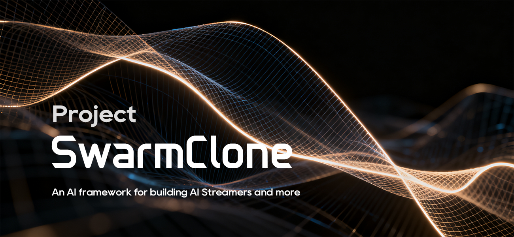

<div align="center">

<br>
<strong>简体中文</strong> | <a href="./docs/README_en.md">English</a>
<br><br>
<!-下面这行空行千万别删->


[](https://github.com/SwarmClone/SwarmClone/blob/main/LICENSE)
[](https://www.python.org)
[]()
[](https://qm.qq.com/q/8IUfgmDqda)
</div>

---

# 简介

这是一个代码完全开源、可高度定制的AI虚拟主播开发框架，致力于为开发者和研究者提供构建智能虚拟主播的全套解决方案。我们的目标是打造一个能够在B站、Twitch等主流直播平台实现高质量实时互动的AI主播系统，同时保持框架的灵活性和可扩展性。

### 特色
1. ✅**自主可控的核心架构**：从底层交互逻辑到上层应用全部开源，开发者可以完全掌控系统行为
2. ✅**灵活的 AI 模型支持**：适配 OpenAI Chat Completion API，轻松接入 Qwen、DeepSeek 等大模型，也可使用 Ollama 本地部署模型
3. ✅**完善的直播功能**：支持弹幕实时互动等核心直播场景
4. **模块化设计理念**：各功能组件可自由替换，方便开发者按需定制

---

# 技术栈与技术路线
1) 基础大语言模型搭建（技术探索项目，见[MiniLM2](https://github.com/swarmclone/MiniLM2)）*已基本结束*
2) 虚拟形象设定 *进行中*
3) 直播画面设计 *进行中*
4) 技术整合（对语言大模型、语音模型、虚拟形象、语音输入等，统一调度）*进行中*
5) 接入直播平台
6) 精进：
    - 长期记忆 RAG
    - 联网 RAG
    - 与外界主动互动（发评论/私信？）
    - 多模态（视觉听觉，甚至其他？）
    - 整活（翻滚/b动静等）
    - 唱歌
    - 玩 Minecraft 、无人深空等游戏

---

# 快速开始
#### 先决条件：
- Python 3.10
- 可用的 C 编译工具和构建工具（后文会详细列出）
- Node.js 22.0+（推荐直接使用最新版）

### 1. 克隆本项目并准备部署：

请确保您的磁盘中有足够的可用空间.


```console
git clone https://github.com/SwarmClone/SwarmClone.git
cd SwarmClone
git submodule update --init
```

### 2. 安装系统依赖：

如果您此前安装过这些系统依赖，您可以选择暂时跳过本步骤。若后续操作出现缺少依赖项的报错，您可以在这里核对您是否安装了所有依赖项。

#### Linux 系统依赖

若您使用的是 Linux 系统/WSL，请根据您的 Linux 发行版选择相应命令执行：

**Ubuntu/Debian**

```console
sudo apt update
sudo apt install -y build-essential python3 python3-venv python3-pip cmake libgl1-mesa-dev libglu1-mesa-dev freeglut3-dev git wget
wget -qO- https://pixi.sh/install.sh | sh
```

**Fedora/CentOS/RHEL**
```console
sudo dnf install -y gcc gcc-c++ make python3 python3-virtualenv python3-pip cmake mesa-libGL-devel mesa-libGLU-devel freeglut-devel git wget
wget -qO- https://pixi.sh/install.sh | sh
```

**Arch Linux**
```console
sudo pacman -S --noconfirm base-devel python python-pip cmake mesa glu freeglut git wget pixi
```
>💡对于使用其他包管理工具的发行版，请根据您的发行版选择类似的包。

#### Windows 系统依赖

若您使用的是 Windows 系统，您需要安装 Visual Studio，并在安装时勾选 C 语言相关选项，确保安装了可用的 C 语言编译器。然后，安装`pixi`：
```console
powershell -ExecutionPolicy ByPass -c "irm -useb https://pixi.sh/install.ps1 | iex"
```

### 3. 设置 Python 环境
```console
pixi install
```
>💡在 Windows 系统下 deepspeed 的安装有可能引发错误，声称无法导入 torch，可以设置 `DS_BUILD_OPS="0"` 环境变量并重新运行上述命令解决。

### 4. 设置 Node.js 环境

1. 请确保您安装了符合要求的 `Node.js（22.0+）` 和 `npm（10.0+）`

您可以运行下面的命令来检查：
```console
node --version
npm --version
```

2. 进入 `panel` 目录并安装依赖：

```console
cd panel
npm install
npm run build
```

### 5. 启动项目
回到项目根目录（ `panel` 目录的父目录）执行下面的命令：
```console
python -m swarmclone
```
随后进入终端给出的网址即可引入网页控制端。

---

# 如何参与开发？
- 您可以加入我们的开发QQ群：1017493942

如果你对 AI 、虚拟主播、开源开发充满热情，无论你是框架开发者、模型训练师、前端/图形工程师、产品设计师，还是热情的测试者，蜂群克隆（SwarmClone）都欢迎你的加入！让我们共同创造下一代开源AI虚拟直播系统！

---

# 项目开源协议

本项目采用 [**GNU General Public License v3.0**](https://www.gnu.org/licenses/gpl-3.0.en.html)作为开源许可证。  
完整许可证文本请参阅 [**LICENSE**](/LICENSE) 文件。

**在您复制、修改或分发本项目时，即表示您同意并愿意遵守 GPLv3 的全部条款。**

**特别提醒：请尊重开源精神，勿将本项目代码用于闭源倒卖、专利钓鱼或其他损害社区利益的行为。违者将承担相应法律责任并受到社区谴责。**