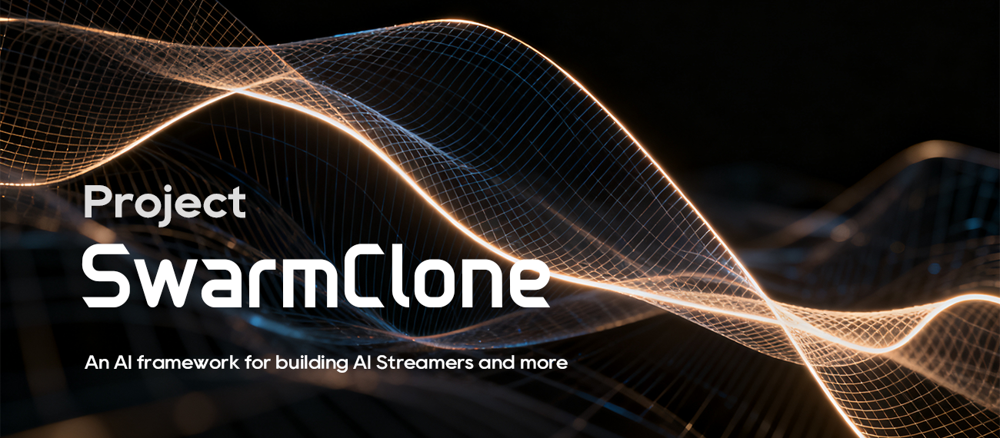

<div align="center">

<br><br>
<h1>Project SwarmClone</h1>
<strong>一个开源、可高度定制的 AI 虚拟主播系统</strong>
</div>

## 当前能力

SwarmClone 正在从原 Python 原型迁移到 Rust backend + Electron/Vue dashboard 架构。本仓库当前包含：

- Rust LLM 会话层，支持 OpenAI、Anthropic、Gemini，并可通过 `kind = "anthropic"` 接入 DeepSeek Anthropic-compatible API。
- Rust 语音模块骨架，包含后端能量 VAD、阿里云 Fun-ASR WebSocket 接入、阿里云 CosyVoice WebSocket TTS 接入。
- Rust HTTP/WebSocket backend，用于编排 `VAD -> ASR -> LLM -> TTS`。
- Electron/Vue dashboard，用于麦克风采集、实时状态展示、文本烟测和音频播放。

## 配置

复制示例配置到可执行文件目录下的 `config.toml`，再填写真实密钥：

```bash
copy config.example.toml target\debug\config.toml
```

重要：真实 `config.toml` 已加入 `.gitignore`，不要提交 API Key。

最小配置包含：

```toml
[llm.providers.deepseek]
kind = "anthropic"
base_url = "https://api.deepseek.com/anthropic"
api_key = "sk-your-deepseek-key"

[llm.roles.default]
provider = "deepseek"
model = "deepseek-v4-flash"

[speech.dashscope]
websocket_url = "wss://dashscope.aliyuncs.com/api-ws/v1/inference"
api_key = "sk-your-dashscope-key"
```

## 启动后端

```bash
cargo run --bin backend
```

默认监听：

```text
http://127.0.0.1:17860
```

主要接口：

- `GET /health`
- `GET /api/config/public`
- `GET /api/roles`
- `POST /api/chat`
- `POST /api/tts`
- `WS /api/realtime`

## 启动 Dashboard

```bash
cd dashboard
npm install
npm run dev
```

Dashboard 会连接本地 backend，并提供：

- 麦克风监听
- VAD 状态
- ASR 识别文本
- LLM 回复文本
- TTS 音频播放
- 文本链路烟测

## CLI 烟测

在已配置 `target/debug/config.toml` 的情况下运行：

```bash
cargo run --bin backend -- smoke "你好，请介绍一下 SwarmClone。"
```

该命令会执行：

```text
文本输入 -> DeepSeek LLM -> CosyVoice TTS -> smoke-output.mp3
```

`smoke-output.mp3` 已加入 `.gitignore`。

## 实时链路验收

1. 准备 `target/debug/config.toml` 并填写 DeepSeek 与 DashScope API Key。
2. 启动 Rust backend。
3. 启动 Dashboard。
4. 点击“开始监听”。
5. 对麦克风说话。
6. Dashboard 应展示 VAD、ASR、LLM、TTS 事件，并播放合成语音。

## 注意事项

- 浏览器 WebSocket 不能设置自定义鉴权 Header，因此 DashScope ASR/TTS 由 Rust backend 代理。
- TTS 使用 CosyVoice WebSocket 协议，严格按照 `run-task -> task-started -> continue-task -> finish-task -> task-finished` 流程。
- Fun-ASR 文档抓取不可用时，当前实现采用 DashScope 实时语音类通用指令模型，关键字段保留在配置中，便于按官方文档调整。
- 当前 VAD 是能量阈值第一版，后续可替换为 WebRTC VAD 或 Silero VAD。

## 开源协议

本项目采用 [Apache-2.0 license](./LICENSE)。
